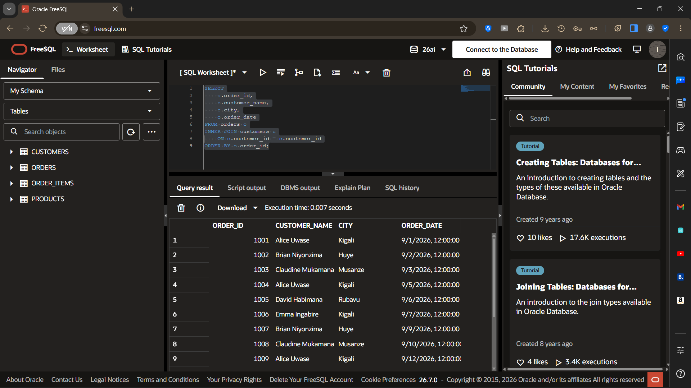
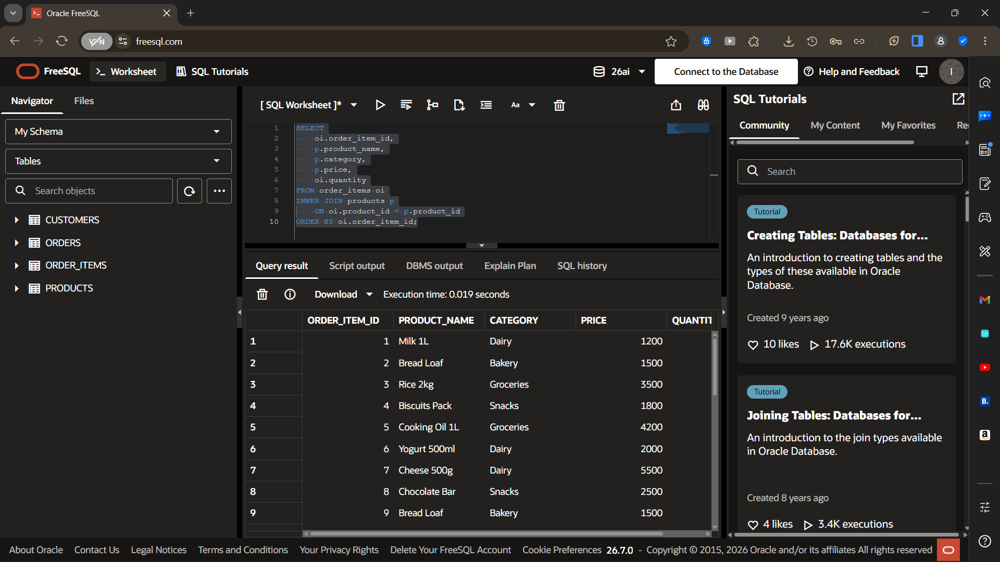
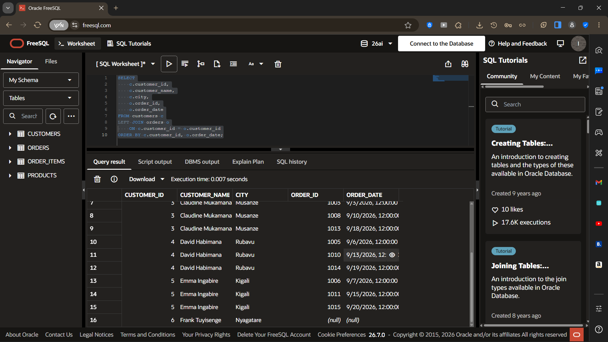
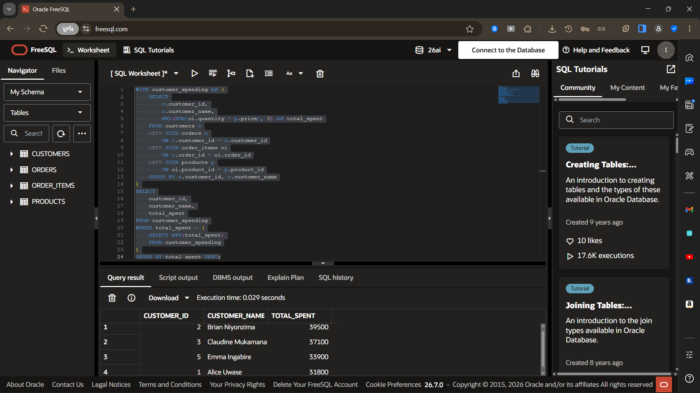
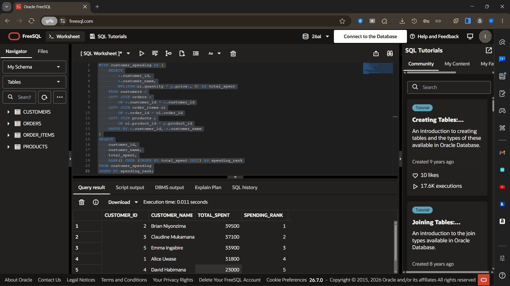
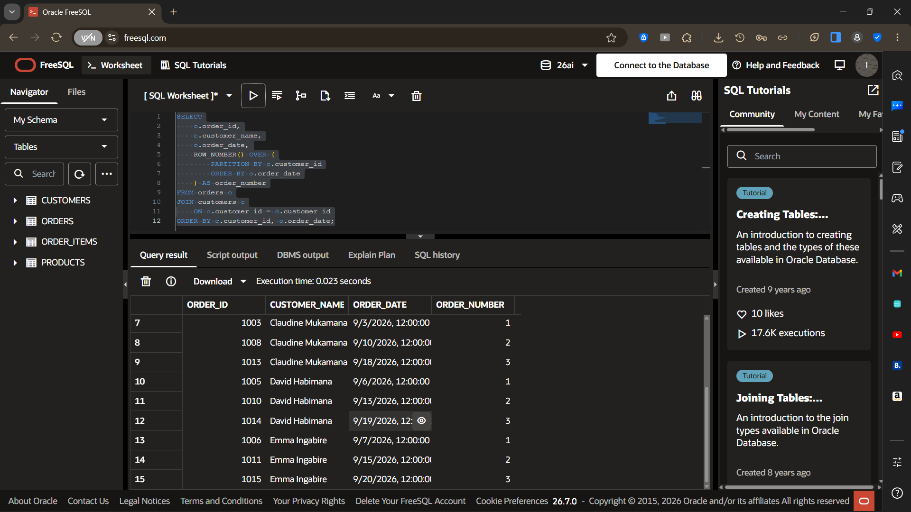
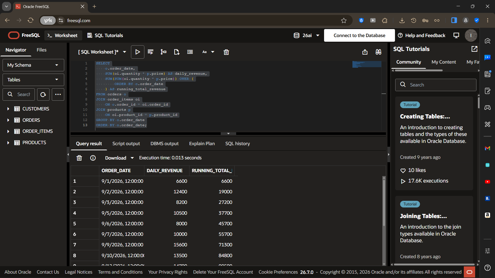
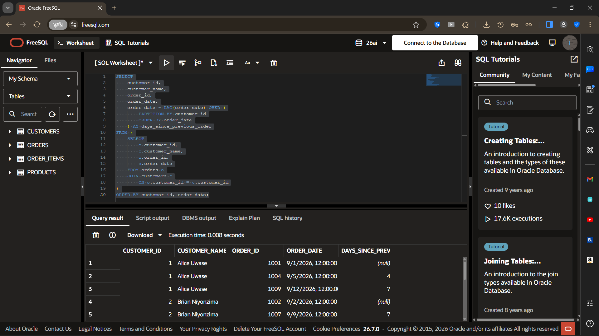
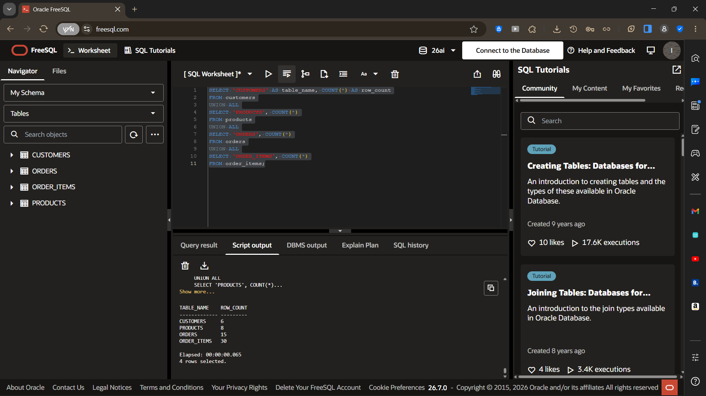
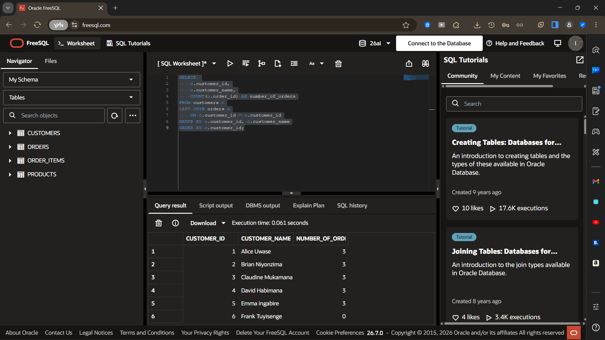

# Assignment I — Sunrise Supermarket

## Student Information

- **Name:** Ishimwe Semuhungu Daniel
- **Student ID:** 20251SEN 037
- **DBMS:** Oracle Database 26ai through FreeSQL

## Short Summary

This project implements a relational database for Sunrise Supermarket. It stores customers, products, orders, and order items, and uses SQL JOINs, a Common Table Expression (CTE), and window functions to analyze customer purchases, order history, and revenue.

## Business Scenario

Sunrise Supermarket needs a database system to manage customer information, products, orders, and order items. The database helps the supermarket answer business questions such as:

- Which customer placed each order?
- What products were included in each order?
- Which customers have not placed any orders?
- Which customers spend more than the average customer?
- How do customers rank by total spending?
- How many orders has each customer placed?
- How does revenue accumulate over time?
- How many days pass between a customer's orders?

## Database Structure

The database contains four main tables:

- **customers** — stores customer information.
- **products** — stores product names, categories, and prices.
- **orders** — stores customer orders and order dates.
- **order_items** — stores the products and quantities included in each order.

The database was populated with:

- 6 customers
- 8 products across 4 categories
- 15 orders across multiple dates
- 30 order items

## How to Run

1. Open an Oracle SQL environment such as FreeSQL.
2. Create the four tables using the SQL script in this repository.
3. Insert the sample data.
4. Run the required JOIN, CTE, and window-function queries shown below.
5. The screenshots in the `screenshots` folder show the resulting outputs.

## Required JOIN Queries

### 1. Every Order with Customer Name, City, and Date

```sql
SELECT
    o.order_id,
    c.customer_name,
    c.city,
    o.order_date
FROM orders o
INNER JOIN customers c
    ON o.customer_id = c.customer_id
ORDER BY o.order_id;
```

**Explanation:**  
This INNER JOIN connects the `orders` table with the `customers` table using `customer_id`. It displays each order together with the customer's name, city, and order date.

**Result:**  
The query displays the orders together with the customer information associated with each order.



### 2. Every Order Item with Product Name, Category, Price, and Quantity

```sql
SELECT
    oi.order_item_id,
    p.product_name,
    p.category,
    p.price,
    oi.quantity
FROM order_items oi
INNER JOIN products p
    ON oi.product_id = p.product_id
ORDER BY oi.order_item_id;
```

**Explanation:**  
This JOIN connects `order_items` with `products` using `product_id`. It shows the product name, category, price, and quantity for each order item.

**Result:**  
The query displays the product details and quantity associated with each order item.



### 3. All Customers and Their Orders, Including Customers with No Orders

```sql
SELECT
    c.customer_id,
    c.customer_name,
    c.city,
    o.order_id,
    o.order_date
FROM customers c
LEFT JOIN orders o
    ON c.customer_id = o.customer_id
ORDER BY c.customer_id, o.order_date;
```

**Explanation:**  
This LEFT JOIN starts with all customers and matches their orders when available. Customers without orders are still displayed, with NULL values for the order columns.

**Result:**  
The query confirms that all customers are included, including customers who have not placed an order.



## CTE Query — Customers Above Average Spending

```sql
WITH customer_spending AS (
    SELECT
        c.customer_id,
        c.customer_name,
        NVL(SUM(oi.quantity * p.price), 0) AS total_spent
    FROM customers c
    LEFT JOIN orders o
        ON c.customer_id = o.customer_id
    LEFT JOIN order_items oi
        ON o.order_id = oi.order_id
    LEFT JOIN products p
        ON oi.product_id = p.product_id
    GROUP BY c.customer_id, c.customer_name
)
SELECT
    customer_id,
    customer_name,
    total_spent
FROM customer_spending
WHERE total_spent > (
    SELECT AVG(total_spent)
    FROM customer_spending
)
ORDER BY total_spent DESC;
```

**Explanation:**  
The CTE named `customer_spending` first calculates the total amount spent by each customer. The main query then calculates the average spending and returns only customers whose total spending is above that average.

**Business Interpretation:**  
Customers above the average spending level can be considered higher-value customers based on the purchases represented in the database. The supermarket can use this information when analyzing customer purchasing behavior.



## Window Functions

### 1. Rank Customers by Total Amount Spent

```sql
WITH customer_spending AS (
    SELECT
        c.customer_id,
        c.customer_name,
        NVL(SUM(oi.quantity * p.price), 0) AS total_spent
    FROM customers c
    LEFT JOIN orders o
        ON c.customer_id = o.customer_id
    LEFT JOIN order_items oi
        ON o.order_id = oi.order_id
    LEFT JOIN products p
        ON oi.product_id = p.product_id
    GROUP BY c.customer_id, c.customer_name
)
SELECT
    customer_id,
    customer_name,
    total_spent,
    RANK() OVER (ORDER BY total_spent DESC) AS spending_rank
FROM customer_spending
ORDER BY spending_rank;
```

**Explanation:**  
The `RANK()` window function orders customers according to their total spending, with the highest spending receiving the first rank.

**Business Interpretation:**  
The supermarket can use customer spending ranks to understand differences in customer purchasing value.



### 2. Number Each Customer's Orders in the Order Placed

```sql
SELECT
    o.order_id,
    c.customer_name,
    o.order_date,
    ROW_NUMBER() OVER (
        PARTITION BY c.customer_id
        ORDER BY o.order_date
    ) AS order_number
FROM orders o
JOIN customers c
    ON o.customer_id = c.customer_id
ORDER BY c.customer_id, o.order_date;
```

**Explanation:**  
`ROW_NUMBER()` numbers each customer's orders according to their order date. `PARTITION BY` makes the numbering restart for each customer.

**Business Interpretation:**  
This helps the supermarket identify the sequence of purchases made by each customer.



### 3. Running Total Revenue Over Time

```sql
SELECT
    o.order_date,
    SUM(oi.quantity * p.price) AS daily_revenue,
    SUM(SUM(oi.quantity * p.price)) OVER (
        ORDER BY o.order_date
    ) AS running_total_revenue
FROM orders o
JOIN order_items oi
    ON o.order_id = oi.order_id
JOIN products p
    ON oi.product_id = p.product_id
GROUP BY o.order_date
ORDER BY o.order_date;
```

**Explanation:**  
The query first calculates revenue for each order date. The window function then calculates the cumulative revenue as the dates progress.

**Business Interpretation:**  
The running total allows the supermarket to observe how total revenue accumulates over time.



### 4. Days Between a Customer's Orders

```sql
SELECT
    customer_id,
    customer_name,
    order_id,
    order_date,
    order_date - LAG(order_date) OVER (
        PARTITION BY customer_id
        ORDER BY order_date
    ) AS days_since_previous_order
FROM (
    SELECT
        o.customer_id,
        c.customer_name,
        o.order_id,
        o.order_date
    FROM orders o
    JOIN customers c
        ON o.customer_id = c.customer_id
)
ORDER BY customer_id, order_date;
```

**Explanation:**  
`LAG()` retrieves the previous order date for each customer. Subtracting the previous date from the current date gives the number of days between orders.

**Business Interpretation:**  
This helps the supermarket understand how frequently customers return to make purchases.



## Data Verification

The database was checked to confirm that it contains the required minimum data:

- 6 customers
- 8 products
- 15 orders
- 30 order items

One customer was intentionally included without any orders to demonstrate the required LEFT JOIN behavior.





## Challenges and Resolutions

### Challenge 1: Oracle Database Environment

Setting up a local Oracle Database environment on the available Windows system presented environment limitations.

**Resolution:**  
The assignment was completed using an online FreeSQL environment running Oracle Database 26ai, which allowed the required SQL queries to be created and tested without requiring a local Oracle installation.

### Challenge 2: Demonstrating Customers Without Orders

A normal INNER JOIN would exclude customers who had no orders.

**Resolution:**  
A LEFT JOIN was used so that every customer remained in the result, including customers with no matching order.

### Challenge 3: Calculating Customer Spending

Customer spending requires combining quantities and product prices across multiple related tables.

**Resolution:**  
The CTE first calculated total spending for each customer using `quantity × price`, after which the average spending was calculated and used to identify customers above the average.

## Conclusion

The Sunrise Supermarket database demonstrates the use of relational tables, JOINs, a Common Table Expression (CTE), and window functions in Oracle SQL. The queries provide useful information about customer orders, spending, purchasing frequency, and revenue over time.
